# RFP Assistant - Powered by Amazon Bedrock and AWS CDK

## Table of contents
- [RFP Assistant - Powered by Amazon Bedrock and AWS CDK](#rfp-assistant---powered-by-amazon-bedrock-and-aws-cdk)
  - [Table of contents](#table-of-contents)
  - [Overview](#overview)
  - [Configuration](#configuration)
  - [Special Mention](#special-mention)
  - [Deployment](#deployment)
    - [Environment setup](#environment-setup)
      - [AWS Cloud9](#aws-cloud9)
      - [Github Codespaces](#github-codespaces)
      - [Local machine](#local-machine)
    - [Deploy the solution](#deploy-the-solution)
    - [Run user interface locally](#run-user-interface-locally)
    - [Clean up](#clean-up)
  - [Usage](#usage)
    - [Adding data to the application](#adding-data-to-the-application)
    - [Using RFP assistant](#using-rfp-assistant)
    - [Refer the past generated RFP documents](#refer-the-past-generated-rfp-documents)
    - [To use direct chat capability](#to-use-direct-chat-capability)
  - [Architecture Design](#architecture-design)
    - [Overview](#overview-1)
    - [Authentication](#authentication)
    - [Retrieval Augmented Generation (RAG) Engines](#retrieval-augmented-generation-rag-engines)
      - [Amazon OpenSearch Serverless Service](#amazon-opensearch-serverless-service)
      - [Amazon Simple Storage Service (S3)](#amazon-simple-storage-service-s3)
      - [DynamoDB](#dynamodb)
      - [Step Functions](#step-functions)
      - [Amazon Batch](#amazon-batch)
      - [Amazon Simple Queue Service (SQS)](#amazon-simple-queue-service-sqs)
      - [Lambda Functions](#lambda-functions)
    - [Chatbot API Architecture](#chatbot-api-architecture)
      - [DynamoDB](#dynamodb-1)
      - [Amazon Simple Storage Service (S3)](#amazon-simple-storage-service-s3-1)
      - [Amazon Simple Notification Service (SNS)](#amazon-simple-notification-service-sns)
      - [Amazon Simple Queue Service (SQS)](#amazon-simple-queue-service-sqs-1)
      - [AWS Lambda Functions](#aws-lambda-functions)
      - [AppSync](#appsync)
    - [User Interface](#user-interface)
      - [Amazon Simple Storage Service (S3)](#amazon-simple-storage-service-s3-2)
      - [Amazon CloudFront](#amazon-cloudfront)
      - [VPC, Load Balancing, \& Networking](#vpc-load-balancing--networking)
    - [ML Models \& Endpoints](#ml-models--endpoints)
      - [Bedrock](#bedrock)
  - [Security](#security)
  - [Supported AWS Regions](#supported-aws-regions)
  - [Quotas](#quotas)
  - [Clean up](#clean-up-1)
  - [Legal Disclaimer:](#legal-disclaimer)
    - [Use of Third-Party models](#use-of-third-party-models)
    - [Use of Prompt Engineering Templates](#use-of-prompt-engineering-templates)
  - [License](#license)
  - [⚠️ Precautions ⚠️](#️-precautions-️)

## Overview


## Configuration

Before deploying the solution, make sure the configuration in ``bin/config.json`` is correct.

```js
{
  "prefix": "",
  "privateWebsite": false,
  "certificate": "",
  "domain": "",
  "cfGeoRestrictEnable": false,
  "cfGeoRestrictList": [],
  "companyName": "AnyCompany",
  "bedrock": {
    "enabled": true,
    "region": "us-west-2"
  },
  "llms": {
    "sagemaker": []
  },
  "rag": {
    "enabled": true,
    "engines": {
      "aurora": {
        "enabled": false
      },
      "opensearch": {
        "enabled": true
      },
      "kendra": {
        "enabled": false,
        "createIndex": false,
        "external": [],
        "enterprise": false
      }
    },
    "embeddingsModels": [
      {
        "provider": "bedrock",
        "name": "amazon.titan-embed-text-v1",
        "dimensions": 1536
      },
      {
        "provider": "bedrock",
        "name": "amazon.titan-embed-image-v1",
        "dimensions": 1024
      },
      {
        "provider": "bedrock",
        "name": "cohere.embed-english-v3",
        "dimensions": 1024,
        "default": true
      },
      {
        "provider": "bedrock",
        "name": "cohere.embed-multilingual-v3",
        "dimensions": 1024
      }
    ],
    "crossEncoderModels": [
      {
        "provider": "sagemaker",
        "name": "cross-encoder/ms-marco-MiniLM-L-12-v2",
        "default": true
      }
    ]
  }
}
```
## Special Mention
This project incorporates code and resources from the [aws-genai-llm-chatbot](https://github.com/aws-samples/aws-genai-llm-chatbot/) repository. We are grateful for their contributions and the open-source community's collaborative spirit. The original repository can be found at [Repository URL](https://github.com/aws-samples/aws-genai-llm-chatbot/), and we encourage others to explore and contribute to their excellent work.

## Deployment

Deploying a RFP Assistant powered Amazon Bedrock Using AWS CDK on AWS

### Environment setup

To deploy the solution you can use 3 different methods:

1. [AWS Cloud9](#aws-cloud9) (Recommended)
2. [Github Codespaces](#github-codespaces)
3. [Local machine](#local-machine)

#### AWS Cloud9

We recommend deploying with [AWS Cloud9](https://aws.amazon.com/cloud9/).

Use the [Cloud9 console](https://console.aws.amazon.com/cloud9control/home?#/create/) to create a new Cloud9 instance. Ensure you use the following values when creating the instance:

- Select `m5.large` or larger as Instance Type.
- Select `Ubuntu Server 22.04 LTS` as Platform.

The default EBS volume create with the Cloud9 instance is too small and you need to increase it to at least 100GB.
To do this, run the following command from the Cloud9 terminal:

```
./scripts/cloud9-resize.sh
```

See the documentation for more details on [environment resize](https://docs.aws.amazon.com/cloud9/latest/user-guide/move-environment.html#move-environment-resize).

You can now proceed with the [deployment](#deployement)

#### Github Codespaces

To use [GitHub Codespaces](https://github.com/features/codespaces) to deploy the solution, you need the following before proceeding:

1. An [AWS account](https://aws.amazon.com/premiumsupport/knowledge-center/create-and-activate-aws-account/)
2. An [IAM User](https://console.aws.amazon.com/iamv2/home?#/users/create) with **AdministratorAccess** policy granted (for production, we recommend restricting access as needed)

After creating the user, take note of `Access Key ID` and `Secret Access Key`.

Next, click on the button below to open your Codespaces environment.

[](https://codespaces.new/aws-samples/aws-genai-rfpassistant)

Once in the Codespaces terminal, set up the AWS Credentials by running

```shell
aws configure
```

```shell
AWS Access Key ID [None]: <the access key from the IAM user generated above>
AWS Secret Access Key [None]: <the secret access key from the IAM user generated above>
Default region name: <the region you plan to deploy the solution to>
Default output format: json
```

You are all set for deployment; you can now jump to [step 3 of the deployment section below](#deployment-dependencies-installation).

#### Local machine

If are using a local machine, verify that your environment satisfies the following prerequisites:

You have:

1. An [AWS account](https://aws.amazon.com/premiumsupport/knowledge-center/create-and-activate-aws-account/)
2. An [IAM User](https://console.aws.amazon.com/iamv2/home?#/users/create) with **AdministratorAccess** policy granted (for production, we recommend restricting access as needed)
3. [NodeJS 18 or 20](https://nodejs.org/en/download/) installed

   - If you are using [`nvm`](https://github.com/nvm-sh/nvm) you can run the following before proceeding
     ```
     nvm install 18 && nvm use 18
     ```
     or
     ```
     nvm install 20 && nvm use 20
     ```

4. [AWS CLI](https://aws.amazon.com/cli/) installed and configured to use with your AWS account
5. [AWS CDK CLI](https://docs.aws.amazon.com/cdk/latest/guide/getting_started.html) installed
6. [Docker](https://docs.docker.com/get-docker/) installed
   - N.B. [`buildx`](https://github.com/docker/buildx) is also required. For Windows and macOS `buildx` [is included](https://github.com/docker/buildx#windows-and-macos) in [Docker Desktop](https://docs.docker.com/desktop/)
7. [Python 3+](https://www.python.org/downloads/) installed

### Deploy the solution

**Step 1.** Clone the repository.

```bash
git clone https://github.com/aws-samples/aws-genai-rfpassistant
```

**Step 2.** Move into the cloned repository.

```bash
cd aws-genai-rfpassistant
```

**Step 3.** <a id="deployment-dependencies-installation"></a> Install the project dependencies and build the project.

```bash
npm install && npm run build
```

**Step 4.** Once done, run the configuration command to help you set up the solution with the features you need:

```bash
npm run config
```

You'll be prompted to configure the different aspects of the solution, such as:

- The LLMs or MLMs to enable (we support all models provided by Bedrock).

When done, answer `Y` to create or update your configuration.


Your configuration is now stored under `bin/config.json`. You can re-run the `npm run config` command as needed to update your `config.json`

**Step 5.** (Optional) Bootstrap AWS CDK on the target account and region

> **Note**: This is required if you have never used AWS CDK on this account and region combination. ([More information on CDK bootstrapping](https://docs.aws.amazon.com/cdk/latest/guide/cli.html#cli-bootstrap)).

```bash
npx cdk bootstrap aws://{targetAccountId}/{targetRegion}
```

You can now deploy by running:

```bash
npx cdk deploy
```

> **Note**: This step duration can vary greatly, depending on the Constructs you are deploying.

You can view the progress of your CDK deployment in the [CloudFormation console](https://console.aws.amazon.com/cloudformation/home) in the selected region.


```bash
...
Outputs:
GenAIChatBotStack.UserInterfaceUserInterfaceDomanNameXXXXXXXX = dxxxxxxxxxxxxx.cloudfront.net
GenAIChatBotStack.AuthenticationUserPoolLinkXXXXX = https://xxxxx.console.aws.amazon.com/cognito/v2/idp/user-pools/xxxxx_XXXXX/users?region=xxxxx
GenAIChatBotStack.ApiKeysSecretNameXXXX = ApiKeysSecretName-xxxxxx
...
```

**Step 7.** Open the generated **Cognito User Pool** Link from outputs above i.e. `https://xxxxx.console.aws.amazon.com/cognito/v2/idp/user-pools/xxxxx_XXXXX/users?region=xxxxx`

**Step 8.** Add a user that will be used to log into the web interface.

**Step 9.** Open the `User Interface` Url for the outputs above, i.e. `dxxxxxxxxxxxxx.cloudfront.net`.

**Step 10.** Login with the user created in **Step 8** and follow the instructions.

### Run user interface locally

To experiment with changes to the the user interface, you can run the interface locally. See the instructions in the README file of the [`lib/user-interface/react-app`](https://github.com/aws-samples/aws-genai-llm-chatbot/blob/main/lib/user-interface/react-app/README.md) folder.


**Important:** After you have done these changes it's essential to redeploy the solution:

```bash
npx cdk deploy
```

### Clean up

You can remove the stacks and all the associated resources created in your AWS account by running the following command:

```bash
npx cdk destroy
```

> **Note**: Depending on which resources have been deployed. Destroying the stack might take a while, up to 45m. If the deletion fails multiple times, please manually delete the remaining stack's ENIs; you can filter ENIs by VPC/Subnet/etc using the search bar [here](https://console.aws.amazon.com/ec2/home#NIC) in the AWS console) and re-attempt a stack deletion.

## Usage

### Adding data to the application
Step 1) After logging in to the app, create a workspace
1)	Enter workspace name according to the product/service/knowledge repository for which you are planning to use this solution

2)	Embedding Model – Choose the Embeddings Model of your choice. If you need only support for English then you can choose amazon-titan-embed-text-v1, for content with other languages support, use cohere-embed-multilingual model

3)	Data Languages - Choose the languages of the content which is uploaded in to workspace

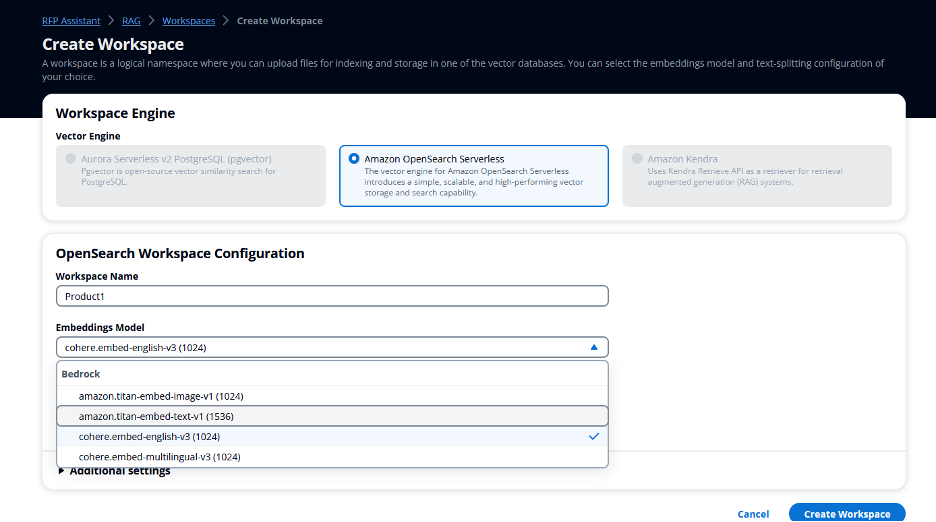

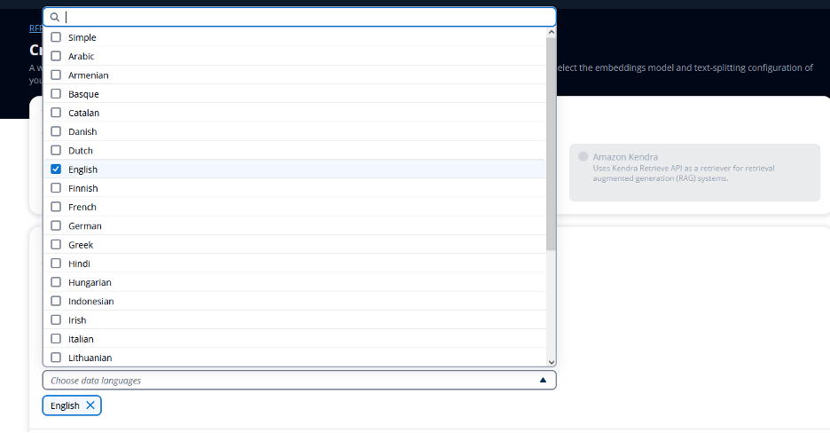

Step 2)  After Workspace is created,  update workspace with all the required content that needs acts as a context for responding to questions and queries related to knowledge base as shown in screenshots below. Workspace gives you option to upload the content as files, Text, Q&A, website crawling and RSS feeds as shown in screenshots below

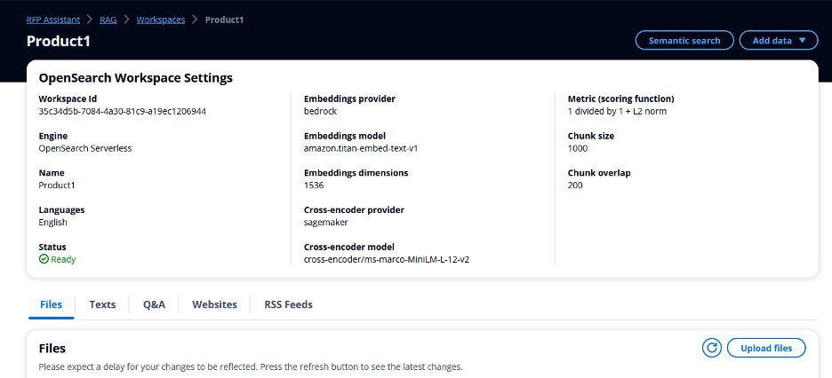

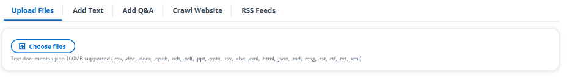

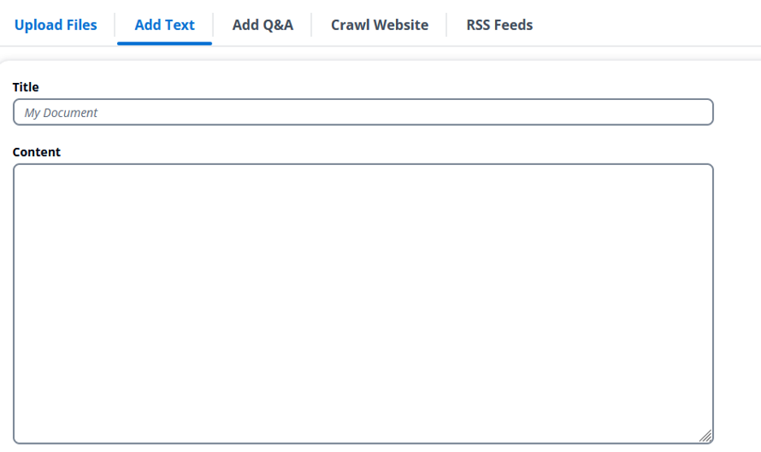

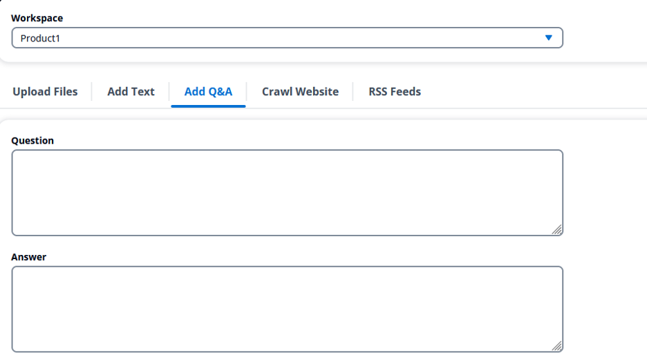

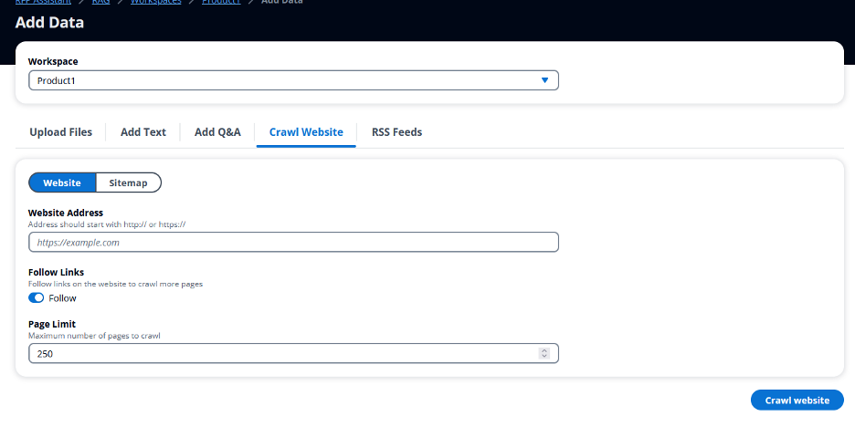

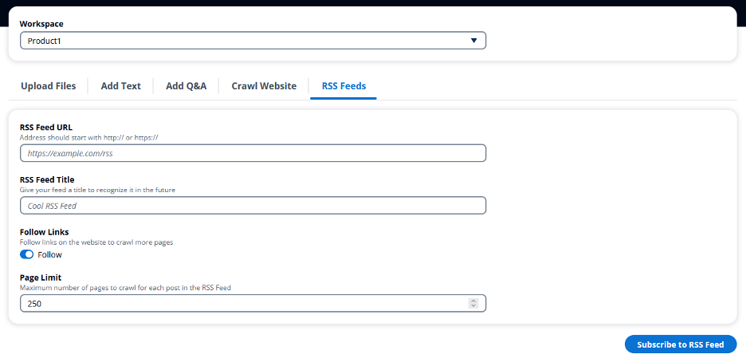

After uploading, wait for some time for documents to process, post process the status will show as processed as shown in screenshot below


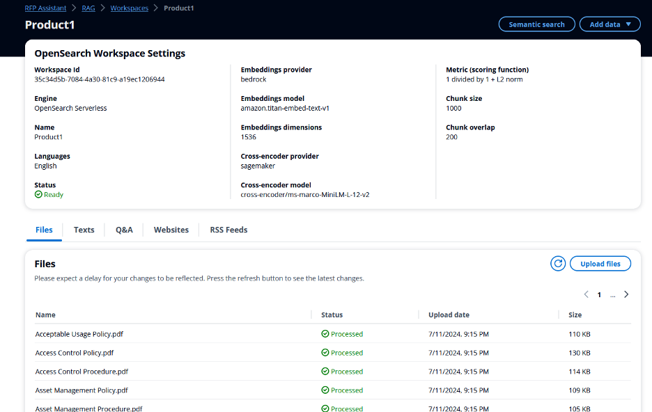


### Using RFP assistant 

1)	Choose an excel which follows template attached here, where questions start from row #2 and column A in excel. Excel workbook can have any number of worksheets.Take the sample file from the below link

      [Sample File](./assets/example_file.xlsx)

2)	Upload excel using excel icon as shown below in the screenshot, upload the file and click on add, Provide any metadata which can help you to identify this session/instance which can later be used to retrieve generated files like customer name, choose the models(currently all Anthropic Models are supported) and workspace whose context has to be used for generating responses from dropdowns

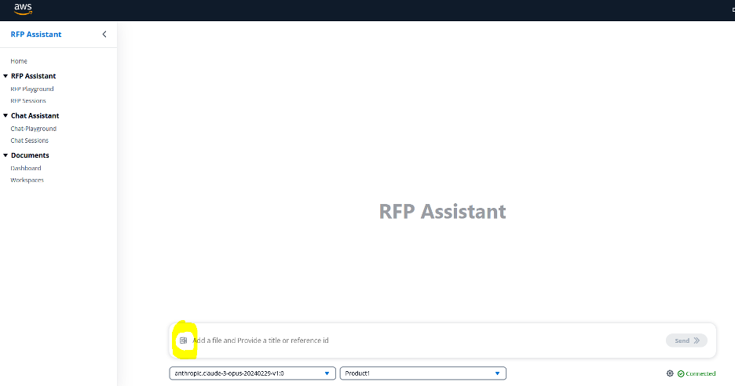

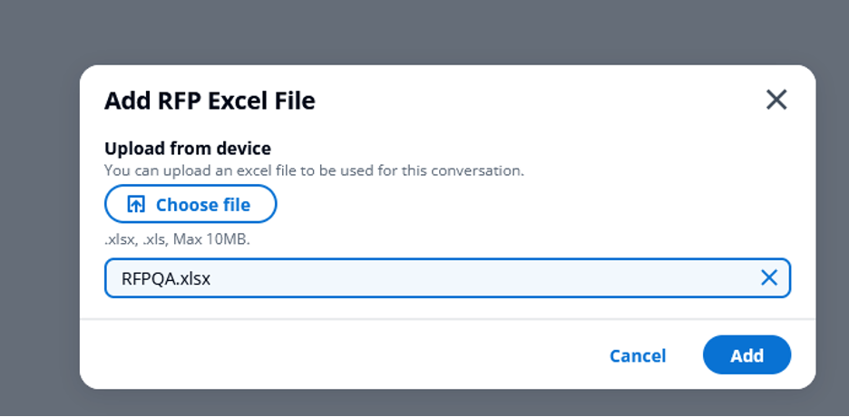

3)	After upload, application will first display sheet wise questions as shown below and starts processing question by question and for questions, which LLM can’t answer, the response will start from unable to answer : as highlighted in screenshots below

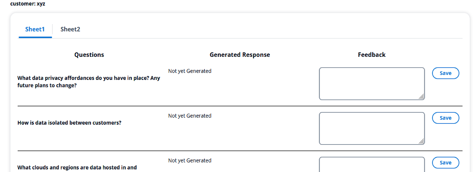

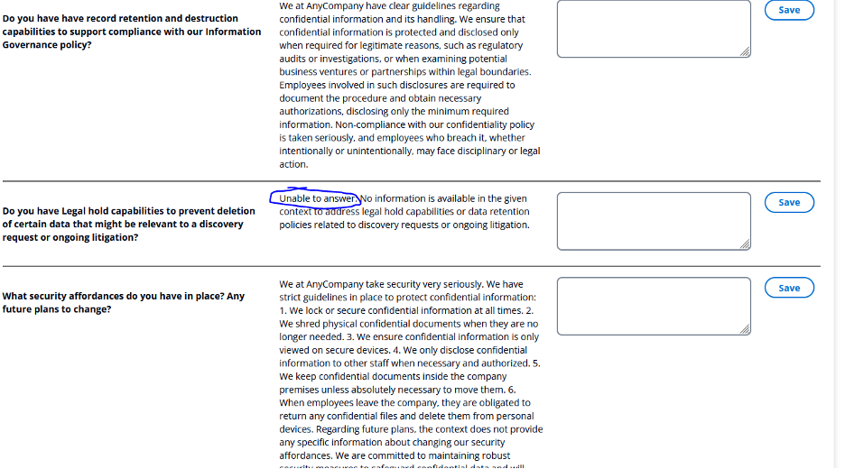


4)	If user likes to change the response, generated then Feedback text to answer can be used to save the user response

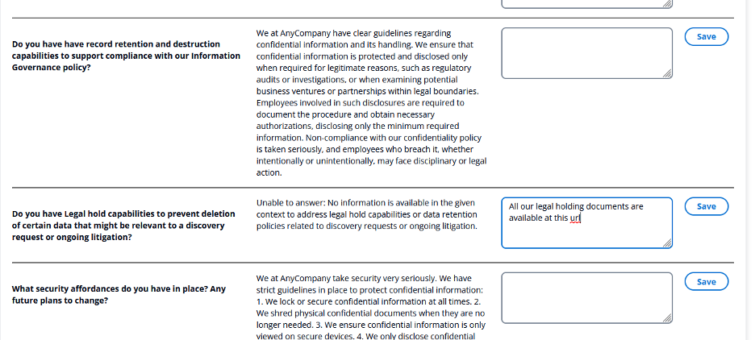

5)	To download the response file, after all the updates, click on Generate response file button at the top of the screen, on successful processing, download response file will appear. Click on it to download the response file in the same excel format and all the answers will get inserted next to the question

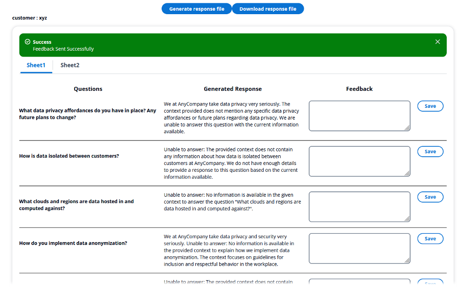

### Refer the past generated RFP documents

To download the files from historical sessions, click on RFP Sessions and click download

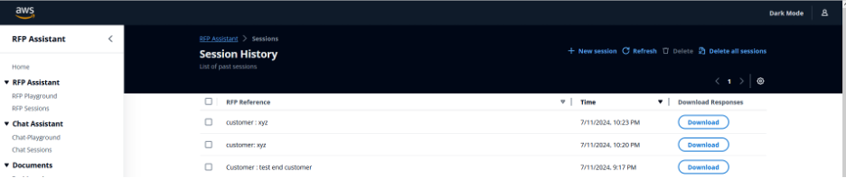

### To use direct chat capability

Application also chat capability in case user wants to ask a single question and want to get a quick response. To use chat option, click on chat-playground, enter question in the bottom text box and application will generate the response as shown in screenshot below

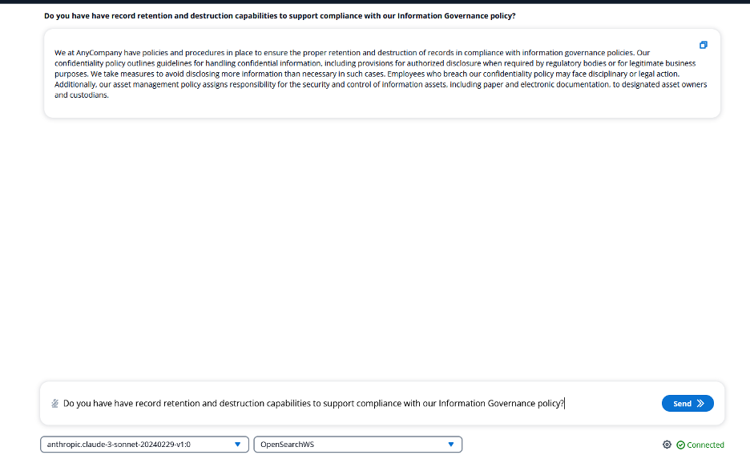


## Architecture Design

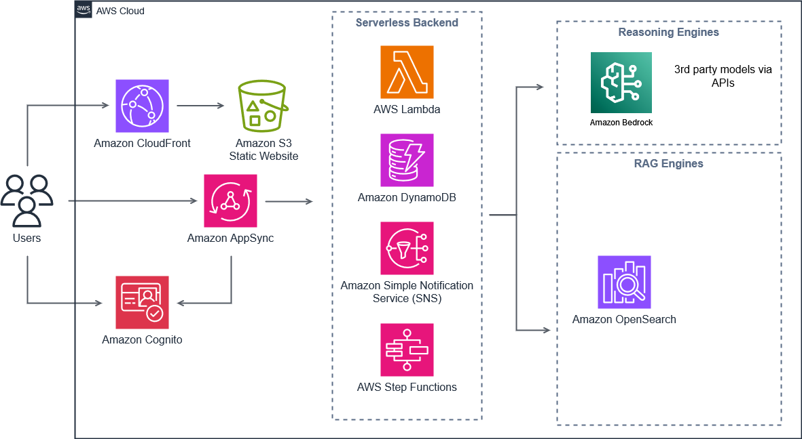

### Overview
This page aims to document the AWS Resources that will be deployed to help understand what permissions will be required to successfully deploy the solution.

Because the solution is configurable to deploy an array of resources, not all resources described in the list may be applicable to your deployment.

It is recommended to review the full documentation to understand deployment configurations, security & cost implications, and overall best practices.

Please note: This is list is considered a best effort approach to helping you understand resources within your environment and may not be not be all encompassing. Please make sure you review the solution and validate requirements before deploying.

### Authentication
Amazon Cognito
- User Pool [Required]
- User Pool Client [Required]
  - Attach an existing Cognito Domain for Federation, adds Permission for User Pool to leverage existing Cognito Domain / Creates OIDC or SAML Identity Provider in Cognito [Optional]

### Retrieval Augmented Generation (RAG) Engines
This section describes the RAG engines that house and return stored data for use with Generative AI. Additionally this section includes resources deployed to support data ingestion and processing for RAG.

#### Amazon OpenSearch Serverless Service
- RAG Workspaces: If option is enabled, users can create OpenSearch Serverless Collections for Retrieval Augmented Generation (RAG) workspaces. [Optional]
  - Note: This is not enabled by default, user must choose to enable this during pre-deployment configuration.

#### Amazon Simple Storage Service (S3)
- File Uploads Bucket: Files uploaded into a RAG workspaces [Required]
- Processing Bucket: Bucket to house files being processed for a RAG workspace [Required]
#### DynamoDB
- WorkSpaces Table: Table that houses data about the RAG Workspaces. Does not house the actual RAG data, but rather the metadata/configuration data for the Workspace. [Required]
- Documents Table: Table that houses the data about documents that have been or need to be ingested into RAG workspaces (websites, PDFs, text files, RSS feeds, etc.) [Required]
#### Step Functions
- File Import Workflow: State Machine responsible for processing the workflow for ingesting files [Required]
- Website Crawling Workflow: State Machine responsible for processing the workflow for Website Crawling [Required]
- Delete Workspace Workflow: State Machine responsible for processing RAG - Workspace deletions (removing resource associated with the RAG Workspace) [Required]
- Delete Document Workflow: State Machine responsible for processing the deletion of a document from within a RAG Workspace [Required]
#### Amazon Batch
- Website Crawler Batch Job: Executes a batch job which runs in an EC2 Instance in an ECS Container to handle website crawling processes. The instance is terminated when processing is not active.
- File Import Batch Job: Executes a batch job which runs in an EC2 Instance in an ECS Container to handle file import processes. The instance is terminated when processing isn't active.
#### Amazon Simple Queue Service (SQS)
- Ingestion Queue: Queue that receives what needs to be ingested and is down stream processed. [Required]
#### Lambda Functions
- RSS Ingestor: Lambda Function responsible for retrieving the latest data from RSS Feed, queueing new posts [Required]
- Trigger RSS Ingestors Function: Triggers the RSS Ingestor function for each RSS Feed with an enabled subscription in the Workspace. [Required]
  - Note: This is triggered by an EventBridge Rule to execute on a fixed Rate
- Crawl Queued RSS Posts Function: Lambda Function responsible for triggering the Website Crawling Workflow for each RSS Post that requires ingestion [Required]
  - Note: This is triggered by an EventBridge Rule to execute on a fixed Rate
- Upload Handler Function: Function responsible for handling file uploads [Required]

### Chatbot API Architecture

#### DynamoDB
**Session Table:** Houses user chat sessions with chatbot **[Required]**

#### Amazon Simple Storage Service (S3)
- **Logs Bucket:** Houses logs for Chatbot API **[Required]**
- **Files Bucket:** Houses files uploaded during chat with chatbot **[Required]**
- **User Feedback Bucket:** Houses data from feedback provided by users chatting with the chatbot and selecting to provide feedback **[Required]**

#### Amazon Simple Notification Service (SNS)
**Messages Topic:** Topic for managing message bus **[Required]**

#### Amazon Simple Queue Service (SQS)
- **Outgoing Messages Queue:** Queue for managing outgoing messages **[Required]**
- **Outgoing Messages Dead-Letter Queue (DLQ):** Queue for handling Dead-Letter messages from the Outgoing Messages Queue **[Required]**

#### AWS Lambda Functions
**AppSync GraphQL API Handler:** Function responsible for handling all inbound GraphQL API requests and processing them **[Required]**

*Note: The AppSync API handler acts as a single lambda for all API requests. This means that this function has a fairly broad permission set attached to interact with database, data stores, AWS Services, etc.*

#### AppSync
**GraphQL API:** Primary API for App, containing both Realtime Streaming for Chatbot and Rest API for data **[Required]**

*Note: Optionally set GraphQL to be private, within a VPC and not exposed to public internet. 
GraphQL API Resolvers have permissions to call their defined functions/endpoints.*

### User Interface
#### Amazon Simple Storage Service (S3)
- Upload Logs Bucket: Bucket that logs from user uploads is stored [Required]
- Website Bucket: Bucket that contains the front-end React-based UI [Required]
#### Amazon CloudFront
- Front-End Distribution: Public facing CDN serving the website content from the Website Bucket. [Optional, default included]
  - Note:By default, the solution is configured as public facing with a CloudFront Distribution. During pre-deployment configuration, the solution can be deployed inside a VPC as a private site.
  - "Public" refers to accessibility of the website, not ability to login. A Public site leverages Amazon Cognito as described in the Authentication section.
#### VPC, Load Balancing, & Networking
- Private Website Configuration: The solution can be deployed as a private site, with restricted external access. During pre-deployment configuration, the solution can be deployed within a VPC by deploying an Application Load Balancer inside the VPC. This additionally routes traffic between services via VPC Endpoints (e.g. S3 access) [Optional, alternative to CloudFront deployment]

### ML Models & Endpoints
Note: During the pre-deployment configuration, there is a range of configurations that can be applied to customize model usage to meet specific needs. There is model usage associated with inference and text embedding.

#### Bedrock
General Model Access: General access to all bedrock models enabled in the account/region. [Optional]
Bedrock access be disabled (not enabled) via the configuration process before deployment.
Restricted Model Access: If Bedrock is enabled, an IAM Role ARN can be provided to set custom permissions. This is the alternative to the General Model Access. [Optional]

## Security
When you build systems on AWS infrastructure, security responsibilities are shared between you and AWS. This [shared responsibility](http://aws.amazon.com/compliance/shared-responsibility-model/) model reduces your operational burden because AWS operates, manages, and controls the components including the host operating system, virtualization layer, and physical security of the facilities in which the services operate. For more information about AWS security, visit [AWS Cloud Security](http://aws.amazon.com/security/).

> The sample code, software libraries, command line tools, proofs of concept, templates, or other related technology (including any of the foregoing that are provided by our personnel) is provided to you as AWS Content under the AWS Customer Agreement, or the relevant written agreement between you and AWS (whichever applies). You should not use this AWS Content in your production accounts, or on production or other critical data. You are responsible for testing, securing, and optimizing the AWS Content, such as sample code, as appropriate for production grade use based on your specific quality control practices and standards. Deploying AWS Content may incur AWS charges for creating or using AWS chargeable resources, such as running Amazon EC2 instances or using Amazon S3 storage.

There are a number of security considerations that should be taken into account prior to deploying and utilising this sample. The [security section](https://aws-samples.github.io/aws-genai-conversational-rag-reference/overview/security/) outlines each of these considerations.

## Supported AWS Regions

This solution uses multiple AWS services, which might not be currently available in all AWS Regions. You must launch this construct in an AWS Region where these services are available. For the most current availability of AWS services by Region, see the [AWS Regional Services List](https://aws.amazon.com/about-aws/global-infrastructure/regional-product-services/).

## Quotas

Service quotas, also referred to as limits, are the maximum number of service resources or operations for your AWS account.

Make sure you have sufficient quota for each of the services implemented in this solution and the associated instance types. For more information, refer to [AWS service quotas](https://docs.aws.amazon.com/general/latest/gr/aws_service_limits.html).

To view the service quotas for all AWS services in the documentation without switching pages, view the information in the [Service endpoints and quotas](https://docs.aws.amazon.com/general/latest/gr/aws-general.pdf#aws-service-information) page in the PDF instead.

## Clean up

You can remove the stacks and all the associated resources created in your AWS account by running the following command:
```bash
npx cdk destroy
```
After deleting your stack, do not forget to delete the logs and content uploaded to the account.

## Legal Disclaimer:

You should consider doing your own independent assessment before using the content in this sample for production purposes. This may include (amongst other things) testing, securing, and optimizing the content provided in this sample, based on your specific quality control practices and standards.

### Use of Third-Party models

By using this sample, you agree that you may be deploying third-party models (“Third-Party Model”) into your specified user account. AWS does not own and does not exercise any control over these Third-Party Models. You should perform your own independent assessment, and take measures to ensure that you comply with your own specific quality control practices and standards, and the local rules, laws, regulations, licenses and terms of use that apply to you, your content, and the Third-Party Models, and any outputs from the Third-Party Models. AWS does not make any representations or warranties regarding the Third-Party Models.


### Use of Prompt Engineering Templates

Any prompt engineering template is provided to you as AWS Content under the AWS Customer Agreement, or the relevant written agreement between you and AWS (whichever applies). You should not use this prompt engineering template in your production accounts, or on production, or other critical data. You are responsible for testing, securing, and optimizing the prompt engineering as appropriate for production grade use based on your specific quality control practices and standards. AWS may reuse this prompt engineering template in future engagements, but we will not share your confidential data nor your intellectual property with other customers.


## License

This library is licensed under the MIT-0 License. See the LICENSE file.

- [Changelog](CHANGELOG.md) of the project.
- [License](LICENSE) of the project.
- [Code of Conduct](CODE_OF_CONDUCT.md) of the project.
- [CONTRIBUTING](CONTRIBUTING.md#security-issue-notifications) for more information.

## ⚠️ Precautions ⚠️
Before you begin using the solution, there are certain precautions you must take into account:

- Cost Management with self-hosted models on SageMaker: Be mindful of the costs associated with AWS resources, especially with SageMaker models billed by the hour. While the sample is designed to be cost-effective, leaving serverful resources running for extended periods or deploying numerous LLMs/MLMs can quickly lead to increased costs.

- Licensing obligations: If you choose to use any datasets or models alongside the provided samples, ensure you check the LLM code and comply with all licensing obligations attached to them.

- This is a sample: the code provided in this repository shouldn't be used for production workloads without further reviews and adaptation.
